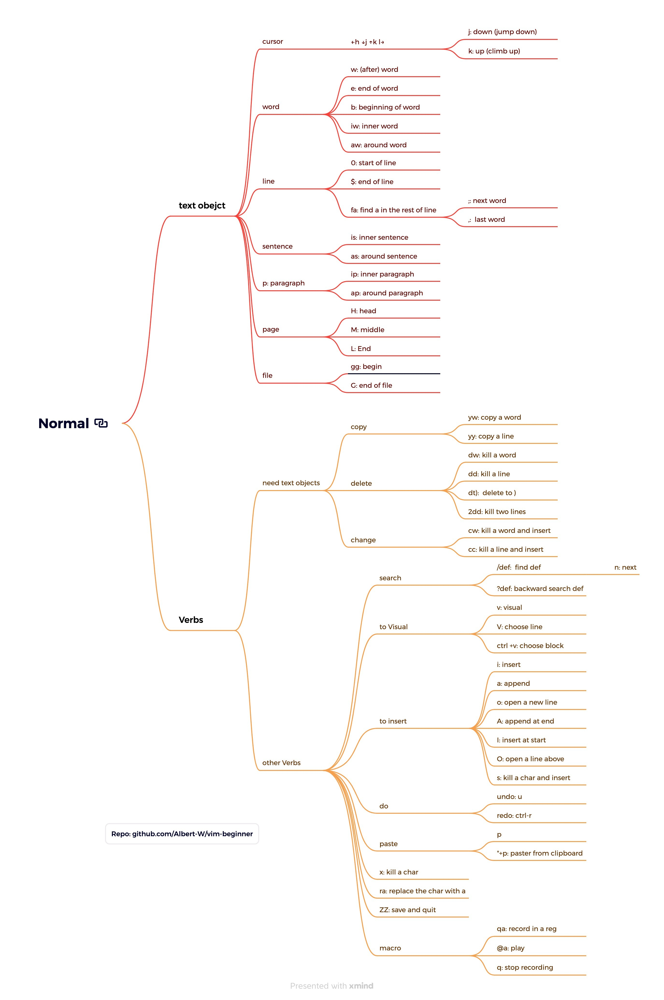

# vim-beginner  

It can be challenging to transition from a full-fledged IDE to Vim. Vim has a steep learning curve, especially for beginners. As someone who has struggled to learn Vim multiple times, I understand the difficulties involved. That's why I have created this guide to help you navigate the initial hurdles.

The key differences between this guide and other guide are that:

- The commands are categorized into 4 modes: `Normal Mode`, `Insert Mode`, `Command-line Mode` and `Visual Mode`.  
- It introduce the idea with `Verbs` and `Nouns`. `Verbs` represent that actions users take, `Nouns` are the text objects which `Verbs` act upon. Inside `Verbs` there are `Transitive Verbs` and `Intransitive Verbs`.
- `Transitive Verbs` are the `Verbs` need to work with `text objects`.
- `Intransitive Verbs` are the `Verbs` work alone without `text objects`.

## Four modes

### Normal Mode

- The first and default mode when you first enter Vim.  
- The most used mode. The reason why this is the default mode please we spend most of our time reviewing and updating text rather than writing new contents.  
- You can't insert text directly in this mode.  

#### Text object

A command will move cursor to a specific place in the file, Text object is the content that cursor just go through.  
A text object are blocks of text which can be select and manipulate as an entity.  for example:  
`h` will move cursor to the left, thus it also represents a text object: the char on the left, `dh` will delete the char on the left.  
`l` will more the cursor to the right, `dl` will delete the char on the right. `d2l` will delete 2 chars on the right.  
`w` means `word`, type `w` will move the cursor outside the current word. `dw` will delete the word. `d2w` will delete two words.  
`0` means start of the line, type `0` will move the cursor to the start of the line. `d0` will delete the whole content that the cursor just go through.  
`$` means end of the line, guess what `d$` will do, and give it a try.  

#### Verb

##### Transitive Verb

Transitive Verb need to work with a text object. There are 3 transitive verbs.  

- `c` - change.  
  - `cw` - delete a word and insert
  - `cc` - delete a line and insert
- `d` - delete.  
  - `dw` - delete a word  
  - `dd` - delete a line
  - `d2d` - delete 2 lines
- `y` - yank(copy), it means pull the text in to register   
  - `yw` - copy a word
  - `yy` - copy a line
  - `y2y` - copy 2 lines  

##### Intransitive Verb

Intransitive Verb are the verb can work without a text object. There are many of them. Some of the most used verbs are

- `p` - paste
- `x` - kill a char
- `s` - kill a char and insert
- `u` - undo
- `ctrl - r` - redo 

A graph of commands in Normal mode are illustrate below. 

### Insert Mode

The mode to insert text, like most other edits.  
To enter Insert Mode, just type in

- `i` - insert
- `a` - append
- `o` - open a new line
- `s` - kill a char and insert
- `cw` - kill a word and insert

Here are some most commonly used shortcuts:

- `Ctrl-h` - Delete the character before the cursor (backspace).
- `Ctrl-w` - Delete the word before the cursor.
- `Ctrl-u` - Delete all characters before the cursor on the current line.
- `Ctrl-t` - Increase the indent of the current line.
- `Ctrl-d` - Decrease the indent of the current line.
- `Ctrl-o` - Temporarily enter Normal Mode to execute one command, then return to Insert Mode.
- `Ctrl-r {register}` - Insert the contents of a register. (e.g., `Ctrl-r 0` will paste the just copied contents)
- `Esc` - Exit Insert Mode and return to Normal Mode.

### Visual Mode
The mode to select texts as a text object and manipulate them with the `Transitive Verb`.  

To enter `Visual Mode`, just type in

- `v`: visual 
- `V`: choose lines
- `Ctrl-v`: choose block.

Inside this mode, you can use following commands: 

- `d`: delete
- `y`: yank
- `p`: paste

### Command-Line Mode

The mode to execute commands, to enter `Command-Line Mode`, just type in `:` in normal mode.

Here are some used commands:

- `:w` - Write (Save the current file).
- `:q` - Quit Vim or Close Pane
- `:wq` - Save the current file and quit Vim.
- `:q!` - Quit Vim without saving changes.
- `:x` - Save the current file and quit Vim (same as `:wq`).
- `:e filename` - Open a file named `filename`.
- `:r filename` - Read the contents of `filename` and insert it into the current file.
- `:set option` - Set an option. They can be configured in `~/.vimrc` file too.  
  - `set nu` - How line numbers
  - `set hls` - Highlight search  
  - `:set clipboard=unnamed` - Use the system clipboard for all yank, delete, change, and put operations.
  - `:syntax on` - Enable syntax highlighting.  It does not require the set keyword.  
- `:noh` - Remove search highlighting.
- `:help` - Open the help documentation.
- `:! command` - Execute an external command (e.g., `:!ls` to list directory contents).
- `:/pattern` - Search for a pattern in the file. (e.g., `:/data` find `data` in the file)
- `:s/pattern/replacement/g` - Substitute `pattern` with `replacement` in the current line.
- `:%s/pattern/replacement/g` - Substitute `pattern` with `replacement` in the entire file.
- `:10` - Go to line 10
- `:vs` - Vertical split window.  
- `:sp` - Split window (Horizontal)  

- `:reg` - list and print all the contents in registers  

